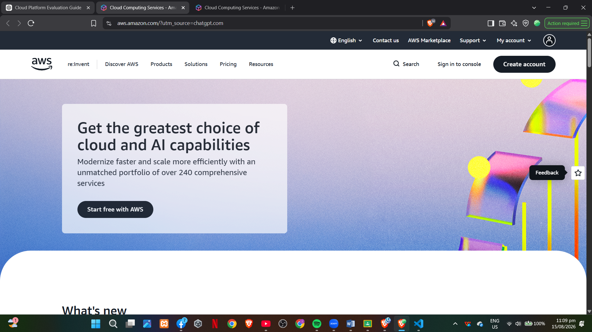

# Amazon Web Services (AWS) Research

## Brief Overview

Amazon Web Services (AWS) is a public cloud computing platform operated by Amazon. AWS provides computing, storage, databases, networking, security, analytics, artificial intelligence, and many other cloud services. AWS supports organizations ranging from startups to large enterprises and government organizations.

AWS launched in 2006 and has developed into one of the major public cloud platforms. Its services allow organizations to build applications without having to purchase and maintain all of the physical infrastructure themselves.

## Global Infrastructure

AWS organizes its infrastructure into geographic Regions and Availability Zones. A Region is a separate geographic area, while Availability Zones are isolated locations within a Region.

AWS designs Regions with multiple Availability Zones to improve availability and fault tolerance. AWS documentation states that each Region has multiple independent Availability Zones, and AWS recommends distributing workloads across multiple Availability Zones when high availability is required.

AWS also provides other infrastructure options such as Local Zones and Wavelength Zones for workloads that need resources closer to users or 5G networks.

## Cloud Management Console

The AWS Management Console is a web-based interface used to access and manage AWS services. It provides centralized access to AWS service consoles and allows users to search for services, manage resources, view billing information, monitor account activity, and configure cloud resources.

# Four Core Services

 1. Amazon EC2

Amazon Elastic Compute Cloud (EC2) provides virtual servers in the AWS cloud. Organizations can use EC2 to run websites, applications, development environments, databases, and other workloads.

2. Amazon S3

Amazon Simple Storage Service (S3) is an object storage service. It can be used to store files, backups, images, videos, application data, and other objects.

 3. Amazon RDS

Amazon Relational Database Service (RDS) is a managed relational database service. It helps organizations run relational databases while AWS handles many administrative tasks such as infrastructure management, backups, and maintenance.

 4. AWS IAM

AWS Identity and Access Management (IAM) controls authentication and authorization for AWS resources. Organizations can use IAM to create users, groups, roles, and permissions so that people and applications receive only the access they require.

## Three Advantages

1. Broad Service Selection

AWS provides a very large collection of cloud services covering computing, storage, databases, networking, security, analytics, AI, and other areas.

2. Global Infrastructure

AWS has a large worldwide infrastructure consisting of Regions and Availability Zones. This allows organizations to deploy workloads closer to customers and design applications for high availability.

3. Scalability

AWS allows organizations to increase or decrease computing and other cloud resources according to workload requirements. This is useful for applications whose demand changes over time.

 #Typical Enterprise Use Cases

AWS can be used by enterprises for web and mobile applications, backup and disaster recovery, data storage, enterprise databases, application modernization, artificial intelligence, analytics, and global e-commerce platforms.

AWS is also suitable for organizations that need to migrate existing workloads to cloud infrastructure and gradually adopt managed cloud services.

# Screenshot

The screenshot below shows the AWS cloud platform and management environment.

## Sources

- AWS About AWS: https://aws.amazon.com/about-aws/
- AWS Global Infrastructure: https://aws.amazon.com/about-aws/global-infrastructure/
- AWS Management Console: https://aws.amazon.com/console/
- AWS Regions and Availability Zones: https://docs.aws.amazon.com/global-infrastructure/latest/regions/aws-regions-availability-zones.html
