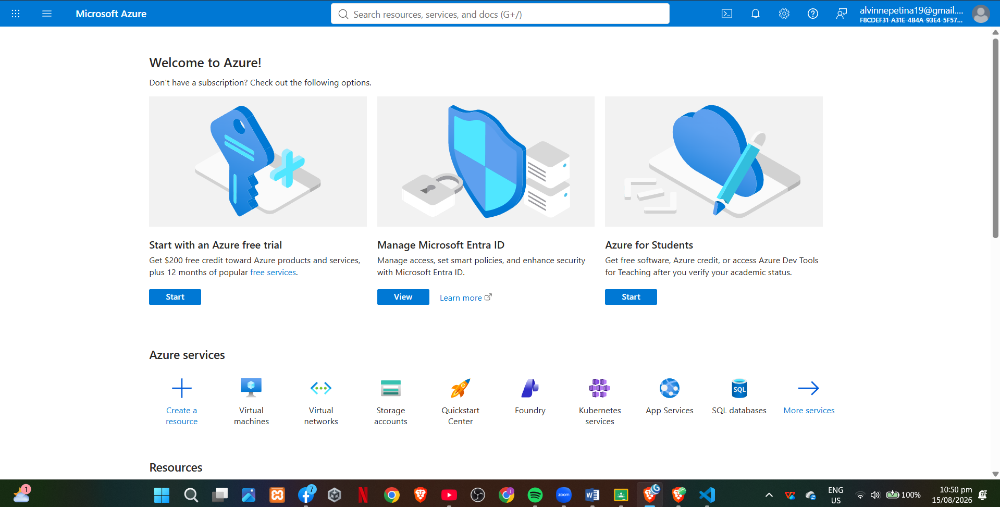

# Microsoft Azure Research

## Brief Overview

Microsoft Azure is Microsoft's public cloud computing platform. Azure provides cloud services for computing, storage, databases, networking, artificial intelligence, security, analytics, containers, and application development.

Azure supports both cloud-native applications and organizations that are migrating existing on-premises infrastructure. It is particularly useful for organizations already using Microsoft technologies such as Windows Server, Microsoft 365, and Microsoft identity services.

## Global Infrastructure

Azure provides more than 70 regions globally. An Azure region consists of one or more datacenters connected by high-capacity, fault-tolerant, low-latency networking.

Many Azure regions provide Availability Zones. Availability Zones are physically separate groups of datacenters within a region with independent power, cooling, and networking. They help organizations improve availability and protect applications against failures affecting individual zones.

Azure geographies also help organizations meet data residency and compliance requirements.

## Cloud Management Console

The Azure Portal is Microsoft's web-based management interface for Azure. It provides a unified location where users can create, deploy, manage, monitor, and optimize Azure resources.

Users can manage virtual machines, storage, databases, networking, applications, access control, and other services through the portal.

## Four Core Services

### 1. Azure Virtual Machines

Azure Virtual Machines provide scalable virtualized computing resources. They support both Windows and Linux operating systems and are useful for applications that require control over the computing environment.

### 2. Azure Blob Storage

Azure Blob Storage is Microsoft's object storage service. It is designed to store large amounts of unstructured data such as documents, images, videos, backups, logs, and other files.

### 3. Azure SQL Database

Azure SQL Database is a fully managed relational database service based on the SQL Server database engine. Azure handles many administrative tasks such as patching, backups, and monitoring.

### 4. Microsoft Entra ID

Microsoft Entra ID is Microsoft's cloud-based identity and access management service. It manages user identities and controls access to applications, data, and resources.

## Three Advantages

### 1. Microsoft Integration

Azure integrates strongly with Microsoft technologies such as Windows Server, Microsoft 365, SQL Server, and Microsoft Entra ID.

### 2. Hybrid Cloud Capabilities

Azure provides services and tools that allow organizations to connect on-premises environments with Azure cloud resources. This is useful for businesses that cannot immediately move all workloads to the cloud.

### 3. Global Infrastructure

Azure operates across more than 70 regions and provides availability options that support high availability, disaster recovery, and data residency requirements.

## Typical Enterprise Use Cases

Azure can be used for Windows Server migration, Microsoft 365 integration, enterprise applications, databases, hybrid cloud environments, virtual desktops, application development, analytics, AI, and disaster recovery.

Organizations with existing Microsoft infrastructure can use Azure to extend their existing systems into the cloud.

## Screenshot

Insert a screenshot of the official Azure Portal or Azure homepage here.

## Sources

- Microsoft Azure Products: https://azure.microsoft.com/en-us/products/
- Azure Regions: https://learn.microsoft.com/en-us/azure/reliability/regions-overview
- Azure Portal: https://azure.microsoft.com/en-us/get-started/azure-portal/
- Azure Virtual Machines: https://learn.microsoft.com/en-us/azure/virtual-machines/overview
- Azure Blob Storage: https://learn.microsoft.com/en-us/azure/storage/blobs/storage-blobs-introduction
- Azure SQL Database: https://learn.microsoft.com/en-us/azure/azure-sql/database/sql-database-paas-overview
- Microsoft Entra ID: https://learn.microsoft.com/en-us/entra/identity/
