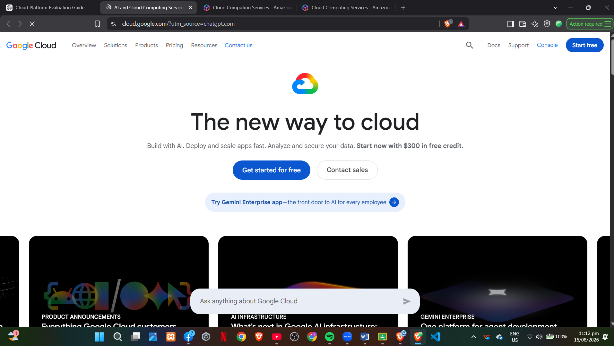

# Google Cloud Platform Research

## Brief Overview

Google Cloud Platform (Google Cloud) is Google's public cloud computing platform. It provides services for computing, storage, databases, networking, artificial intelligence, machine learning, analytics, containers, application development, and security.

Google Cloud allows organizations to build and operate applications using Google's global infrastructure. It supports both traditional virtual machines and modern cloud-native technologies such as containers, Kubernetes, serverless computing, and AI services.

## Global Infrastructure

Google Cloud provides infrastructure across regions and zones around the world. A region is a geographic area containing cloud infrastructure, while zones are locations within regions where resources can be deployed.

Google Cloud's global infrastructure is designed to provide scalable and reliable connectivity. Organizations can select locations based on factors such as latency, availability, regulatory requirements, and the location of their customers.

## Cloud Management Console

The Google Cloud Console is a web-based interface used to manage Google Cloud resources. Users can create and manage virtual machines, storage, databases, networks, Kubernetes clusters, security settings, and other cloud services.

The console also provides tools for monitoring resources, managing permissions, viewing projects, and controlling cloud environments.

## Four Core Services

### 1. Compute Engine

Compute Engine is Google Cloud's infrastructure-as-a-service virtual machine platform. It allows organizations to create and run virtual machines on Google's infrastructure.

### 2. Cloud Storage

Cloud Storage is a scalable object storage service. Data is stored as objects inside buckets and can be used for files, backups, application data, media, and analytics.

### 3. Cloud SQL

Cloud SQL is a fully managed relational database service supporting MySQL, PostgreSQL, and SQL Server. It reduces the amount of database administration required from the customer.

### 4. Google Kubernetes Engine

Google Kubernetes Engine (GKE) is Google's managed Kubernetes service. It allows organizations to deploy and operate containerized applications using Kubernetes while Google manages important parts of the underlying infrastructure.

## Three Advantages

### 1. Artificial Intelligence and Machine Learning

Google Cloud provides a strong collection of AI and machine learning technologies. Its infrastructure and AI services make the platform suitable for organizations developing advanced AI applications.

### 2. Kubernetes

Google developed Kubernetes, and GKE provides a managed Kubernetes environment. This makes Google Cloud an attractive option for organizations building containerized applications.

### 3. Data and Analytics

Google Cloud provides services for large-scale data processing, analytics, and data warehousing. These capabilities are useful for organizations that need to analyze large amounts of business or scientific data.

## Typical Enterprise Use Cases

Google Cloud can be used for artificial intelligence and machine learning, big data analytics, web applications, containerized applications, Kubernetes deployments, data warehousing, application modernization, and global digital services.

## Screenshot

Insert a screenshot of the official Google Cloud Console or Google Cloud homepage here.

## Sources

- Google Cloud Products: https://cloud.google.com/products
- Google Cloud Locations: https://cloud.google.com/about/locations
- Google Cloud Console: https://cloud.google.com/cloud-console
- Compute Engine: https://docs.cloud.google.com/compute/docs/overview
- Cloud Storage: https://docs.cloud.google.com/storage/docs/introduction
- Cloud SQL: https://docs.cloud.google.com/sql/docs/introduction
- Google Kubernetes Engine: https://docs.cloud.google.com/kubernetes-engine/docs/concepts/kubernetes-engine-overview
